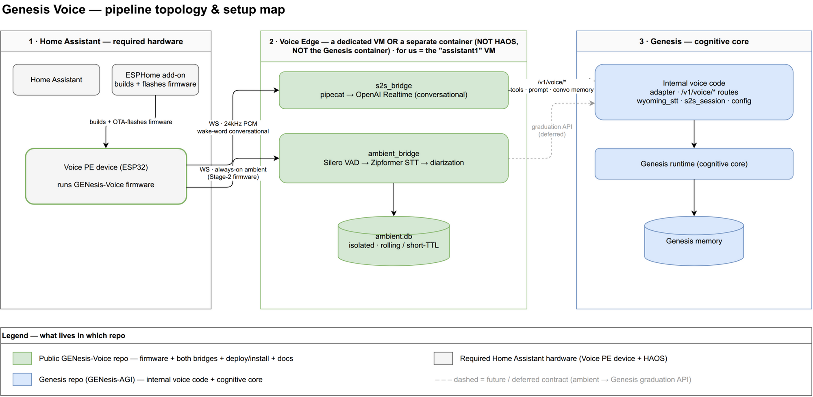

# GENesis-Voice

The voice edge for [Genesis](https://github.com/WingedGuardian/GENesis-AGI). It gives a
Genesis install ears and a spoken voice through a [Home Assistant Voice
PE](https://www.home-assistant.io/voice-pe/) device — running entirely on hardware you
control, with the cloud touched only for the conversational model you opt into.

Two capabilities ship here, independent of each other:

- **Conversational** (`bridges/s2s_bridge`): wake-word, full-duplex spoken conversation
  backed by OpenAI's Realtime speech-to-speech model. Production-ready.
- **Ambient** (`bridges/ambient_bridge`): always-on passive listening that transcribes
  locally (no cloud STT). **Stage 1 — capture only.** It writes to its own isolated,
  short-lived database and never contacts Genesis. The path from ambient transcripts to
  Genesis memory is deliberately not built yet (see the design notes); this is the
  sensory substrate, not a finished feature.

## Topology — three boxes

Voice is not part of Genesis. It runs as a separate edge so the always-on audio path
stays isolated from the cognitive core. Each box can be a VM or a container.



1. **Home Assistant + Voice PE** (required hardware). HA runs the device and the ESPHome
   add-on that builds and flashes the firmware in `firmware/`.
2. **Voice Edge** (a dedicated VM or container — not HAOS, not the Genesis box). Runs
   both bridges. This is where audio is handled.
3. **Genesis** (the cognitive core). Receives only the conversational tool/prompt traffic
   today; ambient stays on the edge.

The device-to-edge wire protocol and the edge-to-Genesis surfaces are specified in
[`CONTRACTS.md`](CONTRACTS.md).

## Layout

```
firmware/         ESPHome custom component + device config + wake word ("hey genesis")
bridges/
  s2s_bridge/     conversational bridge (OpenAI Realtime); edge/ holds the VM deploy
  ambient_bridge/ ambient capture service (VAD -> local STT -> isolated ambient.db)
deploy/           install scaffold + systemd units
docs/             setup guide + architecture diagram
CONTRACTS.md      device->edge WS protocol, edge->Genesis surfaces
```

## Setup

See [`docs/SETUP.md`](docs/SETUP.md) for the full walkthrough: flash the firmware, stand
up the edge box, deploy the bridges, and point the device at the edge. Every
install-specific value (network, model paths, tokens) lives in your own `.env` and
secrets files — the code is generic.

## Status

- `s2s_bridge` — in active use.
- `ambient_bridge` — Stage 1 (local capture verified end-to-end). Diarization, the
  filtering/attention tiers, and any graduation of signal into Genesis are future work
  and intentionally absent here.

## License

MIT. See [`LICENSE`](LICENSE). `bridges/s2s_bridge` derives from an upstream pipecat
example; its original notice is preserved in `bridges/s2s_bridge/LICENSE.upstream`. The
firmware derives from the Home Assistant Voice PE ESPHome firmware.
